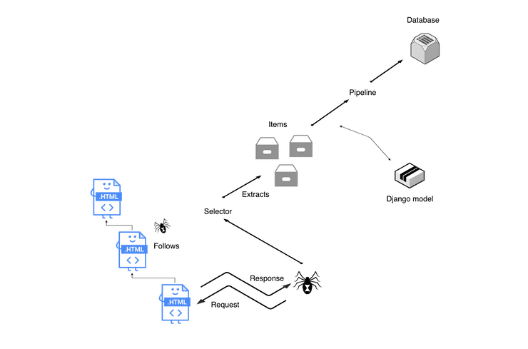
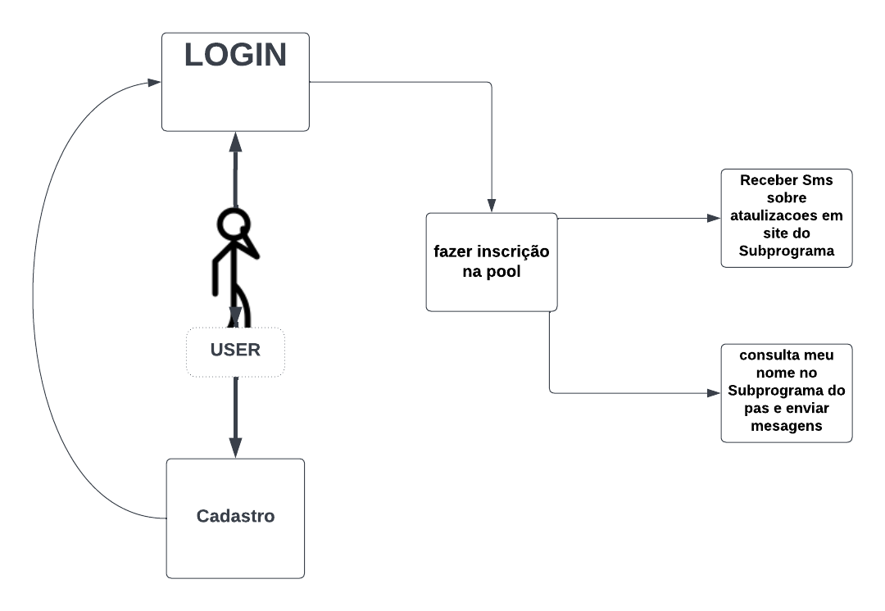
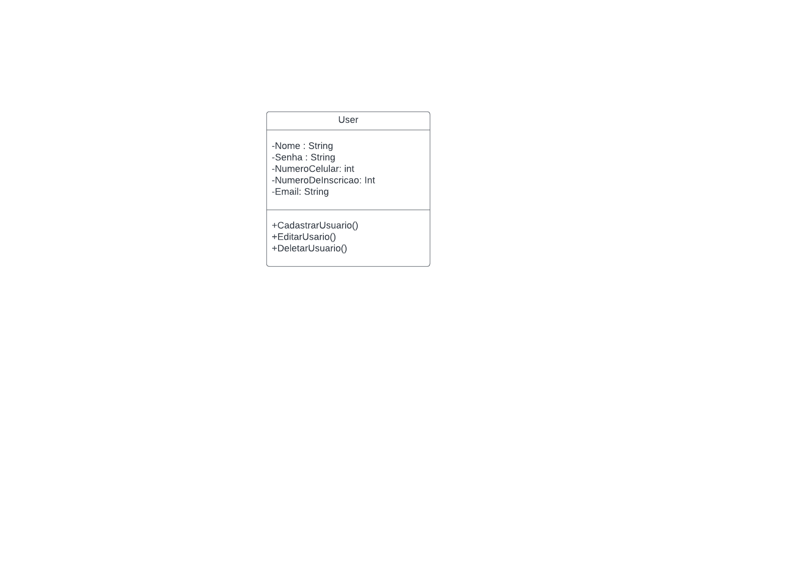
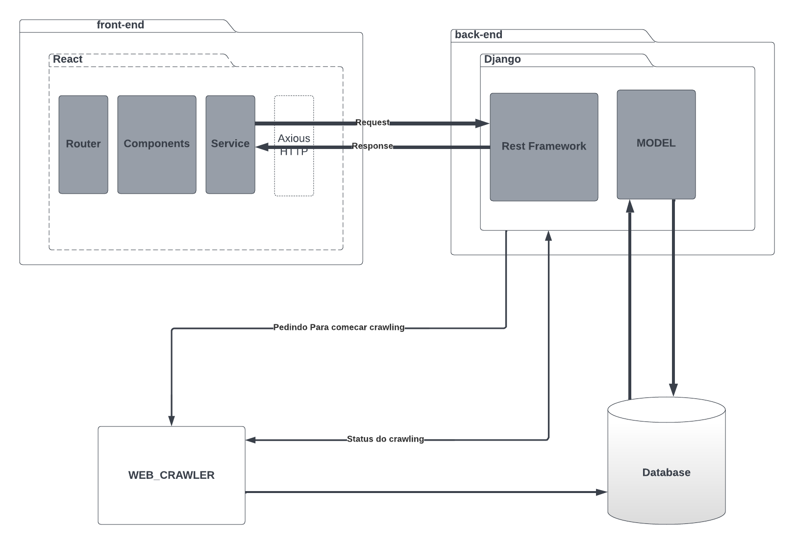
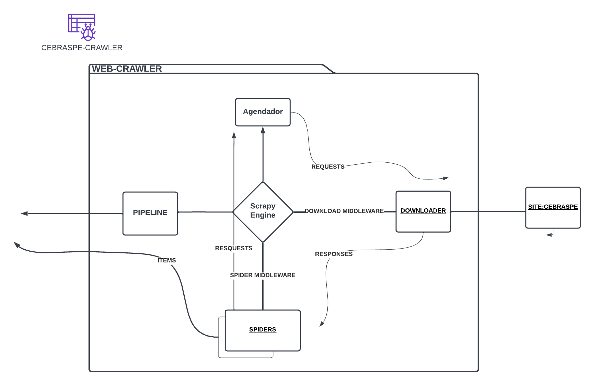

# Documento de Arquitetura de Software

## Histórico de revisão

| Data       | Versão | Descrição| Autor(es)|
| :----------: | :------: | :------: | :------: |
| 03/07/2022 | 0.1    | Abertura do documento de Arquitetura | [Abdul hannan](https://github.com/hannanhunny01)|
| 24/07/2022 | 0.2    | Adcionando Representação Arquitetural,Diagrama de Classe e Pacotes | [Abdul hannan](https://github.com/hannanhunny01)|
|25/07/2022 |1.2| Atualizacao do documento de Pacotes e Representação Arquitetural | [Abdul hannan](https://github.com/hannanhunny01)|
|27/07/2022 |1.3| Adcionando Documento de Caso do Uso | [Abdul hannan](https://github.com/hannanhunny01)|
|05/09/2022 |1.5| Atualização do documento | [João Lucas](https://github.com/hackairos)|

## Sumário

   O documento de arquitetura está organizado em informações da seguinte maneira:
   
   1. [Finalidade](#finalidade)
   2. [Escopo](#Escopo)
   3. [Configurações, Acrônimos e Abreviações](#Configurações)
   4. [Representação da arquitetura](#Representação)
   5. [Diagrama de Caso de uso](#Caso])
   6. [Diagrama de Classes](#Diagrama de Classes)
   7. [Diagrama de Pacotes](#Diagrama de Pacotes)

## Finalidade

   Cebraspe Tracker é uma funcionalidade a qual vai funcionar em uma pagina web e é baseada em web crawler. O site vai ser criado com intuito de ajudar estudantes que estão em processo seletivo, mais especificamente o PAS pois o mesmo acaba tendo varias chamadas e muitos alunos acabam perdendo sua vaga, por isso o Cebraspe Tracker vai ajudar essas pessoas, as pessoas ao se cadastrarem no site elas seriam informados via email e whatsapp caso fossem aprovadas..

## Escopo

   Cebaspre tracker é a solução perfeita para estudantes que estao em processo seletivo tanto pra ajudar as pessoas que perdem sua vaga por falta de entendiento sobre o processo seletivo tanto quanto as pessoas que sofrem de uma ansiedade pesada, para poder tranquiliza-las e tirar das costas dessas pessoas o peso de ficar atualizando todos os dias a pagina do concurso público PAS.

## Configurações, Acrônimos e Abreviações.

   - API: É um acrônimo para Application Programming Interface(Interface de programação de aplicações). A API é um conjunto de definições e protocolos usados no desenvolvimento e na integração de um software, permitindo a interação com outros produtos sem a necessidade de interação com outro software.
   - UML: É um acrônimo para Unified Modeling Language(linguagem de modelagem unificada). O UML é uma linguagem utilizada para visualizar, especificar, construir e documentar a arquitetura completa de um software, fornecendo informações detalhadas para o desenvolvedor implementar o software.
   - UI: É uma sigla para User Interface(interface do usuário). É a área que está associada a criação das interfaces que interagem diretamente com o usuário do software, promovendo formas fáceis e amigáveis de interação no programa.

## Representação da arquitetura

### Front-end
   - ReactJs: É um conjunto de bibliotecas de código aberto seguro para a criação de UIs interativas de forma mais fácil. Toda lógica é escrita em JavaScript da Repassagem de dados ao longo da passagem de dados. Essa tecnologia foi escolhida por quantidade de conteúdo disponível na internet, para o treinamento e aprendizado da equipe, outro ponto positivo é o fórum de dúvidas acerca do assunto estar sempre a disposição.
   
  
### Back-end
  - React Express: React é uma biblioteca para a construção de interfaces de utilizador para a web e outras plataformas. Este guia abrange os aspetos fundamentais do Reagir necessários para construir grandes aplicações web.

 

### Scrapy-selenium
   - Scrapy-selenium é um middleware que é usado em web scraping. scrapy não suporta a scraping dos sites modernos que usam estruturas javascript e esta é a razão pela qual esse middleware é usado com scrapy para crawl esses sites modernos. O Scrapy-selenium fornece as funcionalidades do selenium que ajudam no trabalho com sites javascript. Outra vantagem proporcionada por isso é o driver pelo qual também podemos ver o que está acontecendo nos bastidores. Como o selênium é uma ferramenta automatizada, ele também nos fornece como lidar com tags de entrada e scrap de acordo com o que você passa no campo de entrada.
   
 

## Diagrama de caso de uso

 - Usuário(Aluno) do sistema que terá acesso, após a autenticação, tera a opção de receber o tipo de notificação que ele deseja receber.
  
  

## Diagrama de Classes

   - Essa é a primeira versão das classes no diagrama de classe do projeto Cebraspe-Tracker.
  
  
  

## Diagrama de Pacotes

   - Essa é a primeira versão das classes no diagrama de Pacotes do projeto Cebraspe-Tracker.
  
  
  
  
  

    

   

