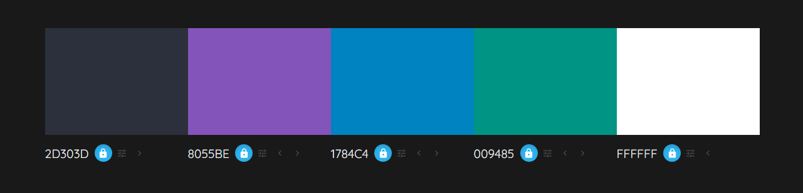

# Identidade Visual

| Data | Versão | Descrição | Autor |
| :-: | :-: | :-: | :-: |
| 16/07/2022 | 0.1 | Criação do documento de Identidade Visual | [João Lucas](https://github.com/HacKairos) |

## Apresentação da Identidade Visual

## Detalhamento e Justificativas

### Nome da aplicação

Cebraspe Tracker

### Fontes

As fontes utilizadas na página serão:

 - **Farro** , para títulos e textos.

### Paleta de cores

